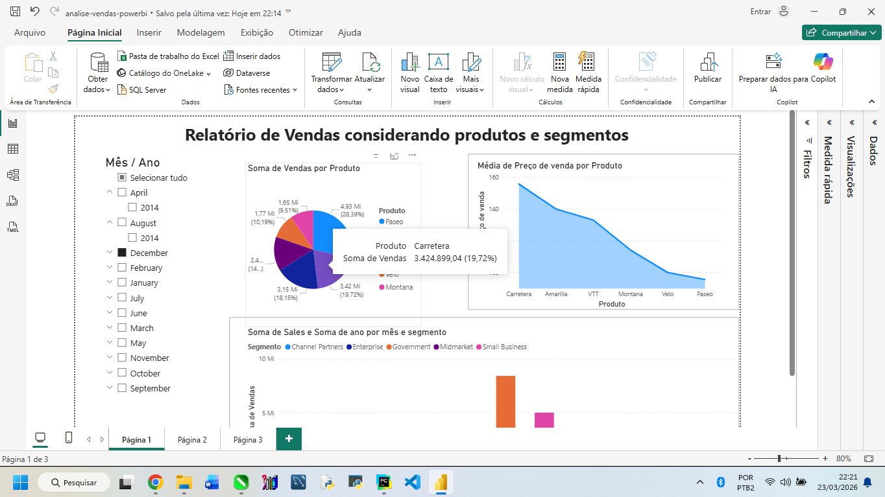
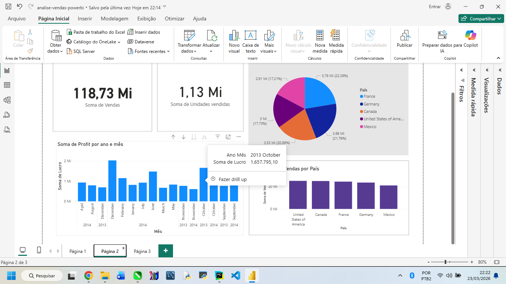
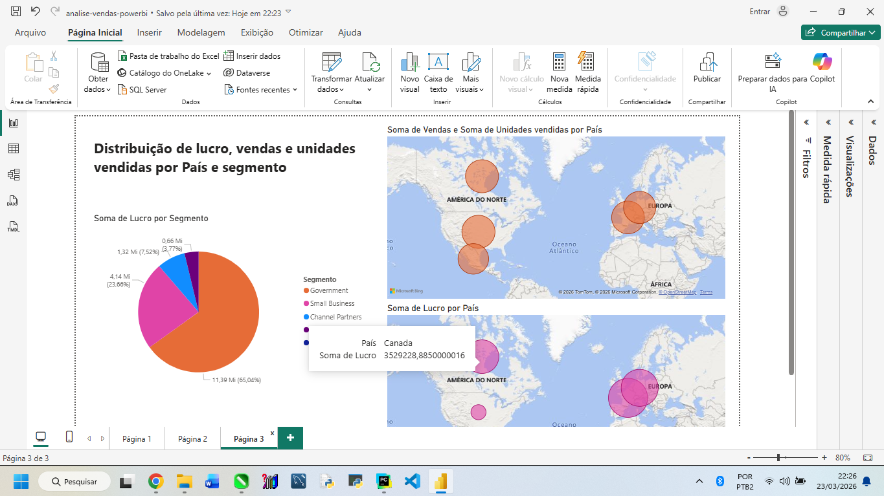

# 📊 Dashboard de Análise de Vendas com Power BI

## 📁 Sobre o projeto

Este projeto foi desenvolvido com foco na análise de dados de vendas utilizando Power BI, com o objetivo de transformar dados em informações úteis para apoio à tomada de decisão.

O relatório foi construído com base em um dataset de vendas contendo informações por produto, país e segmento de clientes.

---

## 🎯 Objetivo

Criar um dashboard interativo para:

- Analisar o desempenho de vendas  
- Identificar países com maior faturamento e lucro  
- Avaliar a lucratividade por segmento  
- Visualizar padrões de vendas ao longo do tempo  

---

## 🛠 Tecnologias utilizadas

- Power BI Desktop  

---

## 📊 Dashboards

### 📄 Página 1 - Produtos e Segmentos

- Vendas por produto  
- Média de preço de venda por produto  
- Vendas ao longo do tempo por segmento  

---

### 📄 Página 2 - Países e Lucro

- Lucro por país  
- Vendas por país  
- Evolução do lucro ao longo do tempo  

---

### 📄 Página 3 - Análise Geográfica

- Mapa de vendas e unidades vendidas por país  
- Mapa de lucro por país  
- Distribuição de lucro por segmento  

---

## 📈 O que foi feito

- Criação de dashboard interativo  
- Organização e tratamento de dados  
- Desenvolvimento de gráficos e indicadores  
- Análise de métricas de vendas  

---

## 🧠 Principais Métricas

- **Sales (Vendas):** valor total vendido  
- **Units Sold (Unidades Vendidas):** quantidade de produtos vendidos  
- **Profit (Lucro):** valor obtido após custos  
- **Sale Price (Preço de Venda):** valor unitário do produto  

---

## 💡 Insight gerado

A análise permite identificar padrões de vendas, produtos e regiões mais lucrativas, possibilitando decisões mais estratégicas como foco em mercados com maior retorno e otimização da performance de vendas.

---

## 🚀 Resultado

- Melhor visualização dos dados  
- Apoio à tomada de decisão  
- Identificação de padrões e tendências  
- Análise comparativa entre regiões e segmentos  

---

## 📁 Arquivos do projeto

- `desafio.pbix` → arquivo do Power BI  
- `dashboard.png` → Página 1  
- `dashboard2.png` → Página 2  
- `dashboard3.png` → Página 3  

---

## 👩‍💻 Autora

Luciana de Carvalho Corrêa  
https://github.com/lucianadcorrea
